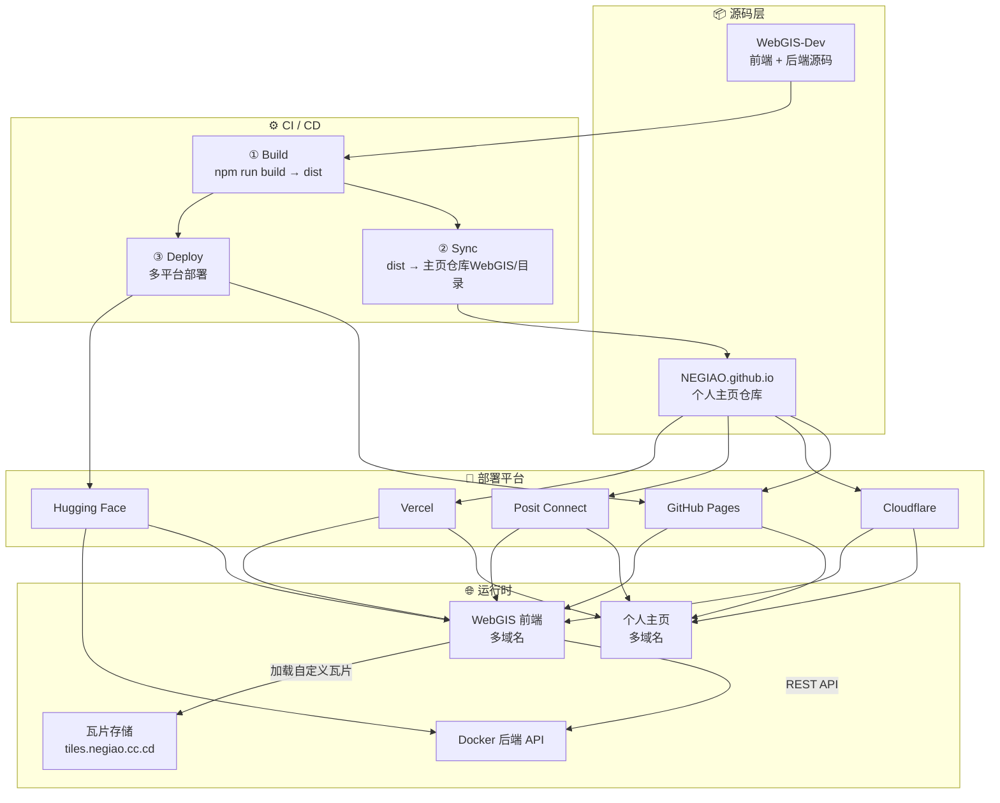

<p align="center">
  <a href="./README.md">🇨🇳 中文</a> | <a href="./Docs/README_EN.md">🇬🇧 English</a>
</p>

<h1 align="center">NEGIAO's WebGIS</h1>

<p align="center">
  <em>专业级前后端分离 WebGIS 平台 · Vue 3 + OpenLayers + Cesium + FastAPI</em>
</p>

<p align="center">
  <a href="https://vuejs.org/"></a>
  <a href="https://fastapi.tiangolo.com/"></a>
  <a href="https://openlayers.org/"></a>
  <a href="https://cesium.com/"></a>
  <a href="https://pages.github.com/"></a>
  <a href="https://www.docker.com/"></a>
  <a href="https://huggingface.co/"></a>
  <a href="#-许可证"></a>
</p>

<p align="center">
  🚀 <strong>在线演示</strong>：<a href="https://webgis.negiao.cn">NEGIAO's WebGIS-Dev — 欢迎点击体验</a>
</p>

<p align="center">
  
  
  
  
</p>

---

## 🌟 核心功能预览

<div align="center">


| **🗺️ 底图卷帘对比** | **🧭 罗盘寻龙点穴** |
| :---: | :---: |
| <a href="https://github.com/user-attachments/assets/c8cb6f16-04e0-4b9a-983f-22538e0bd65a"></a> | <a href="https://github.com/user-attachments/assets/acbb5a56-bff7-44c3-848b-dbe178c52301"></a> |
| **📐 二维数据管理** | **☁️ 三维漫游云景** |
| <a href="https://github.com/user-attachments/assets/91322c8a-bff5-4fcc-b0d4-fdf3924970ff"></a> | <a href="https://github.com/user-attachments/assets/7bedba67-d965-4640-ac32-f5d75630e434"></a> |
| **🤖 智能助手交互** | **🌊 动态淹没分析** |
| <a href="https://github.com/user-attachments/assets/2dbbb794-ef3e-4d7a-b16b-4f381053fec3"></a> | <a href="https://github.com/user-attachments/assets/e26761db-8f91-4f05-90f2-106b28223ab5"></a> |

</div>

---

## 📑 目录

- [🌟 核心功能预览](#-核心功能预览)
- [📑 目录](#-目录)
- [🎯 项目简介](#-项目简介)
  - [核心能力](#核心能力)
- [🚀 快速开始](#-快速开始)
  - [环境要求](#环境要求)
  - [配置（双 env 文件架构，先看这一处）](#配置双-env-文件架构先看这一处)
  - [一键启动（推荐）](#一键启动推荐)
  - [手动启动（高级用户）](#手动启动高级用户)
  - [本地开发镜像（快速获取）](#本地开发镜像快速获取)
- [📁 项目结构](#-项目结构)
- [🏗️ 系统架构](#️-系统架构)
  - [分层架构总览](#分层架构总览)
  - [域名映射](#域名映射)
- [🔁 双向保活机制](#-双向保活机制)
- [🧭 文档导航](#-文档导航)
  - [开发文档](#开发文档)
  - [架构文档](#架构文档)
    - [系统级架构](#系统级架构)
    - [功能架构](#功能架构)
- [Star History](#star-history)
- [📜 版本演进](#-版本演进)
- [📄 许可证](#-许可证)
- [👤 作者与托管](#-作者与托管)

---

## 🎯 项目简介

**NEGIAO's WebGIS** 是一个功能完整、架构清晰的前后端分离 WebGIS 平台（当前版本 V3.5.26），前端托管于 GitHub Pages（正式域名 webgis.negiao.cn），后端以 Docker 部署在 Hugging Face Spaces，通过 RESTful API 通信，支持独立扩展。

> 📚 本 README 仅保留核心概览与导航。完整文档已模块化至 [`Docs/Guide/`](Docs/Guide/)，详见下方「文档导航」。
>
> 📐 架构文档统一存放于 [`Docs/Architecture/`](Docs/Architecture/)，使用 Mermaid 流程图 / 时序图 / 状态图描述各子系统的模块关系、数据流向与文件交互，供技术交接与方案审查参考。每篇架构文档聚焦一个功能域，包含设计决策、实现细节与升级方向。
>
> 不了解项目全貌？试试 [DeepWiki — 向 LLM 提问本项目](https://deepwiki.com/NEGIAO/WebGIS-Dev) [](https://deepwiki.com/NEGIAO/WebGIS-Dev)

### 核心能力

| 领域 | 说明 |
|------|------|
| 🗺️ 2D/3D 双引擎 | OpenLayers 2D + Cesium 3D 一键切换，视图状态双向同步，URL 分享还原 |
| 🌐 丰富底图源 | 70+ 瓦片图源、熔断回退、GCJ-02 纠偏、自定义 XYZ 接入 |
| 📥 多格式数据导入 | GeoJSON / KML / SHP / GLB / CZML / 3D Tiles 拖拽加载，2D/3D 双管线 |
| 📐 空间分析 | 缓冲区 / 叠加 / 泰森多边形 / 聚合 / 渔网等 8 算子（Shapely 后端精确计算） |
| ✨ 三维特效 | 体积云 ray marching、Bruneton 大气、BSM 云影、风场粒子、洪水淹没模拟 |
| 🛣️ 路径规划 | 天地图驾车/公交双管线、搜索选点与路线渲染 |
| 🤖 AI 空间助手 | LLM 集成，三种接入模式（默认 / 个人 Key / 后端代理） |
| 🔐 账号体系 | 邮箱注册登录、Google/GitHub 一键注册登录与绑定、三级身份、会话鉴权、双 AI 配额管理 |
| 🧰 实用工具 | 测量、坐标拾取、风水罗盘、卷帘分析、天气、主题切换、图层管理 |

---

## 🚀 快速开始

### 环境要求

| 依赖 | 用途 |
|------|------|
| Node.js 16+ | 前端构建与开发服务器 |
| Docker Desktop | 容器化后端环境（**强制要求**） |
| LocalDev.bat | Windows 一键启动脚本（推荐） |

### 配置（双 env 文件架构，先看这一处）

| 文件 | git 状态 | 用途 | 读取时机 | `APP_ENV` |
|------|----------|------|----------|-----------|
| **`.env`** | **git 追踪** | 部署环境（生产基线） | `npm run build` + 线上部署 | `production` |
| **`.env.local`** | **git 追踪** | 本地开发（覆盖 `.env`） | `npm run dev` + 本地后端 | `development` |
| `.env.example` | git 追踪 | 全集 key 目录（不写真值） | — | — |

**三层密钥分层**（L1/L2/L3）：

| 层 | 放哪里 | 做什么 |
|----|--------|--------|
| **L1** | 根 `.env` / `.env.local`（不涉密） | URL、端口、前端 `VITE_*`、公开服务端点/超时 |
| **L2** | 管理员面板 + 数据库 | 地图 token、Agent/LLM Key 与参数、底图、公告（常变、动态生效） |
| **L3** | Hugging Face **Secrets** | 绝密：`SUPER_USER`、OAuth secret、SMTP 密码、Supabase Key、监控令牌 |

说明与检查清单：[Docs/Guide/configuration.md](Docs/Guide/configuration.md) · 执行计划：[configuration-architecture-plan.md](Docs/Guide/configuration-architecture-plan.md)

```bash
# 仓库根目录：.env（部署环境）与 .env.local（本地开发）双文件架构
# 两个文件都提交 git（L1 不涉密）
# 本地开发：Vite 读 .env.local，后端读 .env.local（覆盖 .env 的 production 值为 localhost）
# 部署构建：Vite 只读 .env（selectiveEnvPlugin 按 mode 二选一）
```

### 一键启动（推荐）

```bash
# Windows：双击 LocalDev.bat，脚本自动完成：
# 1. 检测环境依赖（Node.js / Docker / docker compose）
# 2. 本地开发环境：前端 Vite 读 .env.local，后端 load.py 读 .env.local（覆盖为 localhost 开发值）
# 3. 智能检测 Docker 镜像状态（首次构建 / 代码热重载 / Dockerfile 变更提示）
# 4. 启动前端开发服务器 → http://localhost:5173
# 5. 自动打开浏览器
```

> `LocalDev.bat` 为纯 ASCII 编码，兼容 GBK/UTF-8 系统；中文彩色输出由同目录 `Write-Color.ps1` 提供。

**访问地址**：前端 http://localhost:5173 · 后端 API 文档 http://localhost:7860/docs

### 手动启动（高级用户）

<details>
<summary><strong>前端本地开发</strong></summary>

```bash
cd frontend
npm install
npm run dev
# → http://localhost:5173
```

</details>

<details>
<summary><strong>后端（Docker Compose）</strong></summary>

```bash
# 首次运行需 --build 构建镜像（文件较大，需等待几分钟）
docker-compose up --build

# 后续运行
docker-compose up
# → http://localhost:7860/docs
```

> 后端已升级为 Docker Compose 容器化部署，不再支持直接运行 `uvicorn`。

</details>

<details>
<summary><strong>生产部署</strong></summary>

```bash
# 一键启动前后端
docker-compose up

# 或单独构建后端镜像
cd backend
docker build -t webgis-backend .
```

</details>

### 本地开发镜像（快速获取）

后端 Docker 镜像已托管至 Docker Hub，构建日期 **2026-08-03**，对应前端V3.5.10版本；可直接拉取用于本地开发，无需本地构建：

```bash
docker pull negiao/webgis_dev:V3.5
```

> 镜像与 `docker-compose.yml` 中 `HF` 服务的基础镜像一致，适用于 `WebGIS-Dev` 本地开发环境启动。

## 📁 项目结构

目录树统一维护于 [`Docs/Guide/`](Docs/Guide/)（原子化，不在 README 重复）：

- [项目根级目录总览 + Docs 文档树](Docs/Guide/project-structure.md)
- [前端完整文件树 `frontend/src/`](Docs/Guide/frontend-structure.md)
- [后端完整文件树 `backend/`](Docs/Guide/backend-structure.md)

---

## 🏗️ 系统架构

> 完整架构文档已模块化至 [`Docs/Architecture/`](Docs/Architecture/)：
> [系统架构总览](Docs/Architecture/system-architecture.md) · [CI/CD 流水线](Docs/Architecture/cicd-pipeline.md) · [部署关系与域名映射](Docs/Architecture/deployment-relationship.md) · [HF Space 双向保活机制](Docs/Architecture/keepalive-hf-space.md)

### 分层架构总览



### 域名映射

**个人主页：**

| 域名 | 平台 | CDN | 国内访问 |
|------|------|-----|----------|
| `negiao.github.io` | GitHub Pages 默认 | ❌ | ⚠️ 不稳定 |
| `negiao.cloud-ip.cc` | GitHub Pages + 自定义域 | ✅ 可配 | ✅ 可访问 |
| `negiao.cc.cd` | Cloudflare Pages | ✅ Cloudflare | ❌ 被屏蔽 |
| `negiao.pages.dev` | Cloudflare Pages 默认 | ✅ Cloudflare | ✅ 流畅 |
| `negiao-pages.share.connect.posit.cloud` | Posit Connect | ❌ | ✅ 可访问 |
| `negiao.vercel.app` | Vercel | ❌ | ❌ 不可访问 |

**WebGIS 前端：**

| 域名 | 平台 | 来源 |
|------|------|------|
| `webgis.negiao.cn` | **正式域名（付费）** | CNAME → GitHub Pages |
| `negiao.github.io/WebGIS-Dev` | GitHub Pages | WebGIS-Dev 仓库根路径 |
| `negiao.github.io/WebGIS` | GitHub Pages | 主页仓库子目录 |
| `negiao.cloud-ip.cc/WebGIS-Dev` | GitHub Pages + 自定义域 | 自动跳转 |
| `webgis.negiao.cc.cd` | Cloudflare Pages | 私有域名挂载 |
| `webgis-dev.pages.dev` | Cloudflare Pages 默认 | 自动分配 |
| `negiao-webgis.share.connect.posit.cloud` | Posit Connect | 主页仓库触发 |
| `negiao-web.static.hf.space` | Hugging Face Static | 直接推送 |

**后端与存储：**

| 组件 | 域名 | 平台 |
|------|------|------|
| 后端 API | `negiao-webgis.hf.space` | Hugging Face Docker |
| 瓦片存储 | `tiles.negiao.cc.cd` | Cloudflare R2 |

> 完整域名清单、部署来源矩阵、平台能力对比见 [deployment-relationship.md](Docs/Architecture/deployment-relationship.md)

---

## 🔁 双向保活机制

HF Spaces 在 24 小时无访问后自动休眠。本平台通过**双向互保活**机制，让 WebGIS 后端（:7860）与 New API 服务（:3000）每 3~6 分钟互相发送模拟真实用户的 HTTP 请求，保持双方始终活跃。

- 公开探活接口：`GET /api/keepalive/ping`（WebGIS）/ `GET /keepalive/ping`（New API）
- 详细架构文档 → [Docs/Architecture/keepalive-hf-space.md](Docs/Architecture/keepalive-hf-space.md)

---

## 🧭 文档导航

### 开发文档

| 文档 | 内容 |
|------|------|
| [项目结构详解](Docs/Guide/project-structure.md) | 完整目录树与各模块职责说明 |
| [交接文档 handover](Docs/Guide/handover.md) | 接手必读：文档地图、三大架构速览、代码坐标、门禁流程与坑清单 |
| [开发约定](Docs/Guide/dev-conventions.md) | 强制规范、分层边界、坐标系统约定、提交前检查 |
| [开发指南与贡献指南](Docs/Guide/dev-guide.md) | 新增页面/API 标准流程、前后端通信、代码风格 |
| [技术栈与常见问题](Docs/Guide/faq.md) | 前后端技术栈、参考资源、FAQ、TODO |
| [更新日志 CHANGELOG](Docs/Guide/CHANGELOG.md) | 完整版本演进历史 |
| [配置指南 configuration](Docs/Guide/configuration.md) | 三层配置（根 .env / Admin+DB / HF Secrets） |
| [配置架构执行计划](Docs/Guide/configuration-architecture-plan.md) | 分阶段收拢配置的落地路线 |
| [OAuth 部署配置指南](Docs/Guide/oauth-deployment.md) | Google/GitHub 登录：控制台申请、HF Secrets 配置、验收与排错全流程 |

### 架构文档

八大核心功能的架构说明沉淀于 [`Docs/Architecture/`](Docs/Architecture/)：

#### 系统级架构

| 文档 | 一句话说明 |
|------|-----------|
| [系统架构总览](Docs/Architecture/system-architecture.md) | 五层分层架构：源码 → CI/CD → 部署 → 运行时 → 用户 |
| [CI/CD 流水线](Docs/Architecture/cicd-pipeline.md) | 五 Job 流水线：Build → Sync → Multi-Deploy 详解 |
| [部署关系与域名映射](Docs/Architecture/deployment-relationship.md) | 域名清单、部署来源矩阵、平台能力对比 |

#### 功能架构

| 功能 | 文档 | 一句话说明 |
|------|------|-----------|
| 2D/3D 双引擎 | [`ol-cesium-dual-engine.md`](Docs/Architecture/ol-cesium-dual-engine.md) | 一键切换、视图同步与 URL 分享还原 |
| 丰富底图源 | [`basemap-source-system.md`](Docs/Architecture/basemap-source-system.md) | 70+ 图源、熔断回退、GCJ-02 纠偏 |
| 多格式数据导入 | [`multi-format-data-import.md`](Docs/Architecture/multi-format-data-import.md) | 拖拽加载，2D/3D 双管线与 blob URL 方案 |
| 空间分析 | [`spatial-analysis-backend.md`](Docs/Architecture/spatial-analysis-backend.md) | 单端点分发，Shapely 后端 8 算子 |
| 路径规划 | [`route-planning.md`](Docs/Architecture/route-planning.md) | 驾车/公交双管线、搜索选点与路线渲染 |
| 三维特效 | [`cesium-3d-effects.md`](Docs/Architecture/cesium-3d-effects.md) | 体积云、风场、浅水叠加与后处理 |
| 实用工具 | [`utility-tools.md`](Docs/Architecture/utility-tools.md) | 测量、坐标拾取、罗盘、分享、GeoTIFF 下载 |
| 账号体系 | [`account-system-ai-quota.md`](Docs/Architecture/account-system-ai-quota.md) | 邮箱登录、三级身份、双 AI 配额 |
| 洪水淹没模拟 | [`cesium-fluid-flood-simulation.md`](Docs/Architecture/cesium-fluid-flood-simulation.md) | GPU 流体管线详解（三维特效配套） |
| 三层配置架构 | [`configuration-three-tier.md`](Docs/Architecture/configuration-three-tier.md) | L1/L2/L3 全景：来源→统一入口→业务/前端消费与门禁 |
| Cesium 统一图层管理 | [`cesium-unified-layer-management.md`](Docs/Architecture/cesium-unified-layer-management.md) | 设计评审稿：3D 数据接入统一 TOC 的两步走方案 |

---

## Star History

<a href="https://www.star-history.com/?repos=NEGIAO%2FWebGIS-Dev&type=timeline&legend=top-left">
 <picture>
   <source media="(prefers-color-scheme: dark)" srcset="https://api.star-history.com/chart?repos=NEGIAO/WebGIS-Dev&type=timeline&theme=dark&legend=top-left&sealed_token=B5ReoH7FL9EMbjs7rJJ3APlIoYZwGKo3g2gC_4_0LxIrQ--e5uhUrYXR7UEBcnb3CU48BAX9--IyzI-TxTszy8HrMJ3oVSVvfowMjrMOxY8n477EUd4_Ip6F8EMaHsKX6H5b1JjudmBoRUn3HxJ1R6zxt3lO1CKGidFnlqFb2W_TXYy_sTk3AS3rn8v8" />
   <source media="(prefers-color-scheme: light)" srcset="https://api.star-history.com/chart?repos=NEGIAO/WebGIS-Dev&type=timeline&legend=top-left&sealed_token=B5ReoH7FL9EMbjs7rJJ3APlIoYZwGKo3g2gC_4_0LxIrQ--e5uhUrYXR7UEBcnb3CU48BAX9--IyzI-TxTszy8HrMJ3oVSVvfowMjrMOxY8n477EUd4_Ip6F8EMaHsKX6H5b1JjudmBoRUn3HxJ1R6zxt3lO1CKGidFnlqFb2W_TXYy_sTk3AS3rn8v8" />
   
 </picture>
</a>

## 📜 版本演进

> 完整历史见 [`CHANGELOG.md`](Docs/Guide/CHANGELOG.md)，以下仅列最近版本摘要。

| 版本 | 日期 | 概要 |
|------|------|------|
| **V3.5.26** | 2026-08-16 | 注册页品牌区显示修复：副标题改为 2 行换行完整显示（不再省略），标题窄屏 16px 留余量；`/terms`、`/privacy` 顶部返回行新增「返回首页」链接（解决 V3.5.25 遗留）。详见[日志](Docs/LLM_record/26-08/2026-08-16/2026-08-16-v3.5.26-brand-text-legal-back-home.md) |
| **V3.5.25** | 2026-08-16 | 注册页新增返回首页入口：头部右侧（语言切换器旁）圆形房子图标按钮 + 品牌区可点强化，logo 布局零影响；`landing.backHome` 双语键入 core.js。详见[日志](Docs/LLM_record/26-08/2026-08-16/2026-08-16-v3.5.25-register-back-home.md) |
| **V3.5.24** | 2026-08-16 | 语言归一 SSOT 收口：`normalizeLocaleLanguage` 非支持值（含空值、历史脏数据如 `'fr'`）不再折叠 `zh-CN`，一律跟随浏览器默认语言；偏好 store / 账号面板本地归一同步收口，冗余兜底函数删除；README 尾注截止版本对齐。详见[日志](Docs/LLM_record/26-08/2026-08-16/2026-08-16-v3.5.24-normalize-locale-ssot.md) |


更早版本（V3.5.23 及以前）请查阅 [完整更新日志 →](Docs/Guide/CHANGELOG.md)

---

## 📄 许可证

[MIT License](LICENSE) — 可自由使用、修改、分发。

> **告知义务**：如果你在任何公开环境（网站、服务器、论文、展览等）运行或部署本项目或其衍生版本，请通过邮件 yaonaigao@gmail.com 或 GitHub Issue 告知作者你的使用即可。

---

## 👤 作者与托管

<div align="center">

**NEGIAO** — [GitHub](https://github.com/NEGIAO) · [个人主页](https://www.negiao.cn) · [DeepWiki 项目分析](https://deepwiki.com/NEGIAO/WebGIS-Dev)

| 源代码 | 前端部署 | 后端部署 |
|:------:|:--------:|:--------:|
| [GitHub](https://github.com/NEGIAO/WebGIS-Dev) | [webgis.negiao.cn](https://webgis.negiao.cn)（正式域名，GitHub Pages 托管） | [Hugging Face](https://NEGIAO-WebGIS.hf.space) |

<sub>V3.5.26 · 开发中 · 最后更新 2026-08-16</sub>

</div>
